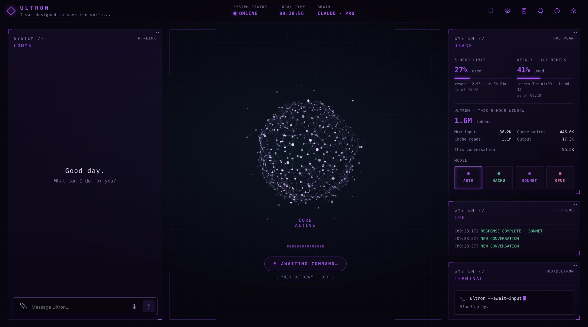
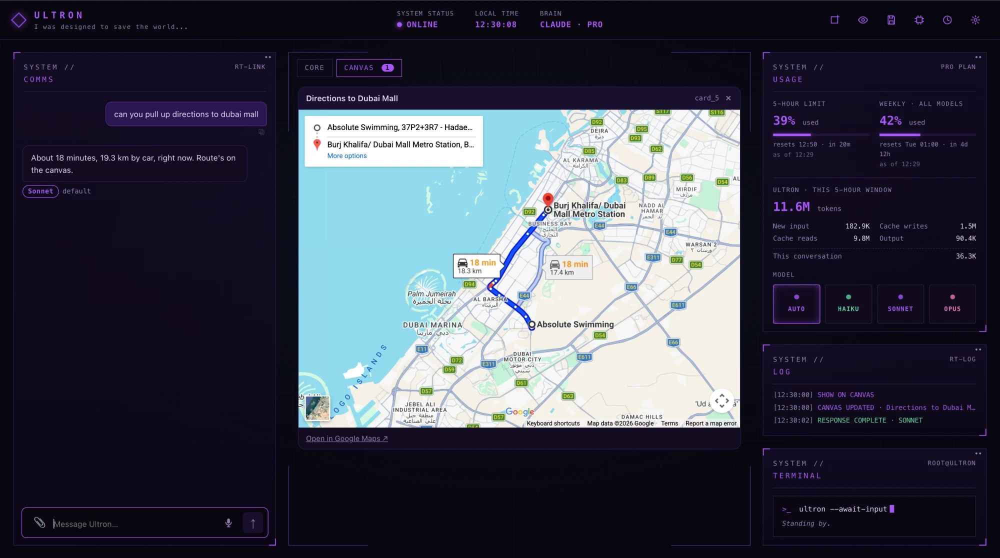
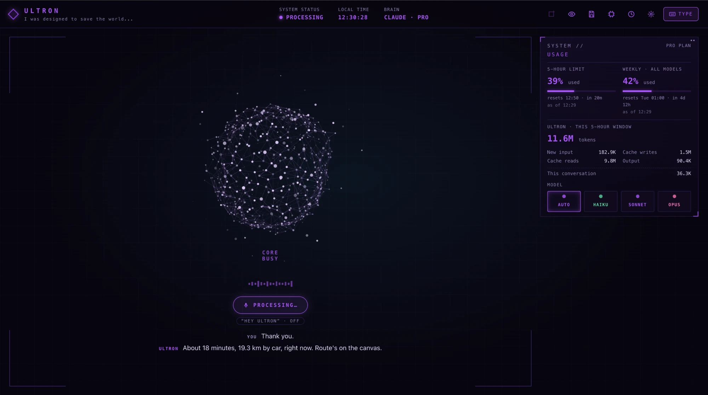
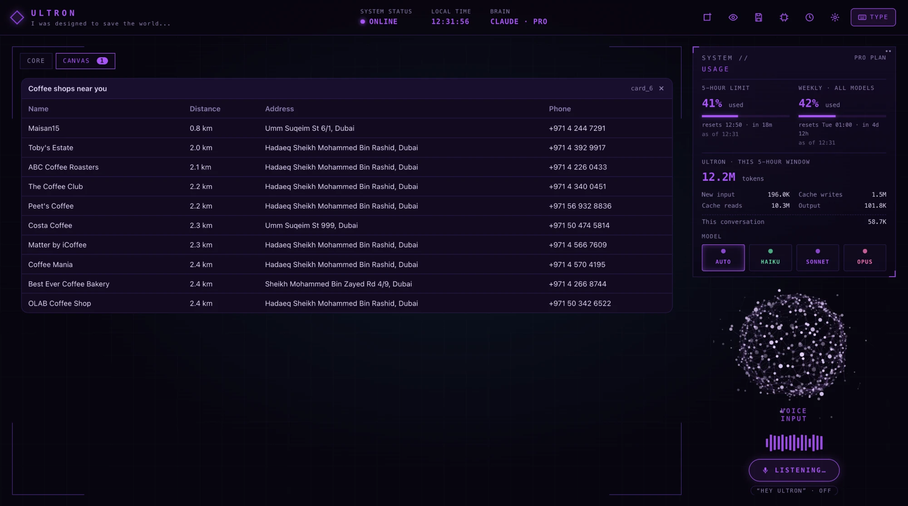

# ULTRON_cBrain

A personal AI assistant with **Claude as its brain**. It runs on your own Mac (or Windows PC),
for one person, in a browser page: a chat on the left, a stage in the middle (the reactor orb,
or a canvas with images, 3D models, maps, videos, tables…), and status panels on the right.
You can type to it or talk to it, and it can talk back.

It runs on your **Claude Pro login** through Claude Code, so there's no API bill. The backend
only listens on `127.0.0.1`; your phone and other computers reach it privately through
Tailscale.

**Contents**

1. [What it looks like](#1-what-it-looks-like)
2. [Setup](#2-setup)
3. [What it can do](#3-what-it-can-do)
4. [How it works](#4-how-it-works)

---

## 1. What it looks like

### Texting

The chat (COMMS) is on the left, the reactor orb in the middle, and on the right your Pro usage
(5-hour and weekly limits, Ultron's own tokens, the model picker), a live log and the terminal
panel. The top bar shows status, time and which brain is in use.



### Texting with a canvas open

Anything bigger than a short answer (maps, tables, drafts, emails, events, images, 3D models,
videos) opens as a CANVAS tab on the stage, so the chat reply stays short. Each reply has a
badge with the model that answered and why (here: Sonnet, the default).



### Speaking

Click the mic (or say "Hey Ultron") and the page switches to voice mode: the chat, log and
terminal panels step aside, the orb takes the stage, and what you said and Ultron's answer
appear as captions under it. The orb and its button follow the real state (listening,
processing, speaking). **TYPE** in the top right goes back to typing.



### Speaking with a canvas open

In voice mode a canvas takes the whole left side and the orb drifts under the usage panel,
so you see the results while you keep talking.



---

## 2. Setup

> ## ⚠️ THIS SETUP WAS MADE FOR AN ANDROID PHONE
> **Some things may be different for iPhone users.** Anything that only works on Android is
> marked **(android phone)**.

### 2.1 What you need

**Required**

| What | Why | Get it |
|---|---|---|
| A Mac (Apple Silicon) or Windows PC | Ultron runs on it | |
| **Claude Pro** (or Max) subscription | the brain; no API key | [claude.ai/upgrade](https://claude.ai/upgrade) |
| **Claude Code**, signed in with that account | Ultron drives Claude through it | [code.claude.com/docs/en/setup](https://code.claude.com/docs/en/setup) |
| **uv** | makes the Python 3.13 environment | [docs.astral.sh/uv](https://docs.astral.sh/uv/) |
| **Node.js 24** | builds the page | [nodejs.org](https://nodejs.org) |
| **Git** | gets the code | [git-scm.com](https://git-scm.com/downloads) |
| **Google Chrome** (or Edge) | the page, voice, and screen sharing work best there | [google.com/chrome](https://www.google.com/chrome/) |

On a Mac, [Homebrew](https://brew.sh) makes the rest easy. On Windows, use `winget`.

**Optional apps** (only for the features that use them)

| App | Used for | Get it |
|---|---|---|
| Xcode command line tools | `Ultron.app` (menu-bar orb) and location | `xcode-select --install` |
| Blender | final 3D files (.blend, .fbx, .stl, …) | [blender.org/download](https://www.blender.org/download/) |
| FFmpeg | editing Reels | `brew install ffmpeg` / `winget install -e --id Gyan.FFmpeg` |
| Tesseract | finding pages in scanned textbooks | `brew install tesseract` |
| Spotify desktop app | playing music | [spotify.com/download](https://www.spotify.com/download) |
| WhatsApp desktop app | sending WhatsApp messages | [whatsapp.com/download](https://www.whatsapp.com/download) |
| Obsidian | your notes | [obsidian.md](https://obsidian.md) |
| Tailscale | Ultron on your phone and Windows PC | [tailscale.com/download](https://tailscale.com/download) |
| MacroDroid | phone volume, taxis, food **(android phone)** | [macrodroid.com](https://www.macrodroid.com) |
| OmniRoute | optional second brain (other providers' models) | [github.com/diegosouzapw/OmniRoute](https://github.com/diegosouzapw/OmniRoute) |

### 2.2 Keys and accounts

Every key is optional: without one, only the feature that needs it is off. They all go in `.env`.

> **Never add `ANTHROPIC_API_KEY`.** If it's set, Claude Code bills that key instead of
> using your Pro subscription. Ultron removes it from its own environment anyway.

| Setting in `.env` | What it turns on | Where to get it |
|---|---|---|
| `PEXELS_API_KEY` | image search, stock video for Reels | free: [pexels.com/api](https://www.pexels.com/api/) |
| `PIXABAY_API_KEY` | more stock video for Reels | free: [pixabay.com/api/docs](https://pixabay.com/api/docs/) (log in to see it) |
| `GROQ_API_KEY` | faster, more accurate speech-to-text (audio goes to Groq) | free: [console.groq.com/keys](https://console.groq.com/keys) |
| `SPOTIFY_CLIENT_ID` | reading the songs in your playlists (playing needs nothing) | [developer.spotify.com/dashboard](https://developer.spotify.com/dashboard) → Create app, tick "Web API", redirect URI `http://127.0.0.1:8000/spotify/callback` |
| `TELEGRAM_BOT_TOKEN`, `TELEGRAM_CHAT_ID` | Ultron texting your phone | message [@BotFather](https://t.me/BotFather) → `/newbot`; press Start in your bot's chat; then `cd backend && .venv/bin/python -m tools.telegram` prints your chat ID |
| `MACRODROID_WEBHOOK` | phone volume, Careem taxis and food **(android phone)** | MacroDroid webhook macros, step by step in `.env.example` |
| `INSTAGRAM_ACCESS_TOKEN` | posting Reels to Ultron's Instagram | a Creator account + a Meta app with "API setup with Instagram Login": [developers.facebook.com/apps](https://developers.facebook.com/apps) |
| `JARVIS_VAULT` | your Obsidian notes | the path to your vault folder |
| `JARVIS_REMOTE_ORIGIN` | Ultron on your phone | the `https://….ts.net` address `tailscale serve` prints |
| `JARVIS_PC_URL`, `JARVIS_PC_TOKEN` | controlling your Windows PC | printed by `windows/install.ps1` (see [2.7](#27-your-windows-pc-optional)) |

The **claude.ai connectors** (Gmail, Google Calendar, Google Drive, TickTick, Canva, Spotify, …)
need no keys: connect them once at [claude.ai/settings/connectors](https://claude.ai/settings/connectors)
and Ultron gets them through your Claude login.

Everything else in `.env` (thinking effort, which connectors to load, quiet hours, voice,
Amazon site, 3D library, OmniRoute models, …) is explained line by line in `.env.example`.

### 2.3 Install

**1. Claude Code**, signed in with your Pro account:

```bash
claude auth status
```

It should show `"subscriptionType": "pro"` (or `max`).

**2. Get the code.** Keep it in your home folder, not Desktop or Documents (macOS restricts those
for background programs):

```bash
git clone https://github.com/erte-del/ULTRON_cBrain.git ~/ULTRON_cBrain
```

**3. Backend** (Python 3.13), from the project folder:

```bash
uv venv --python 3.13 backend/.venv
```

```bash
VIRTUAL_ENV=backend/.venv uv pip install -r backend/requirements.txt
```

On Windows (PowerShell):

```powershell
uv venv --python 3.13 backend\.venv
uv pip install --python backend\.venv\Scripts\python.exe -r backend\requirements.txt
```

There's no `pip` inside this environment: always install with `uv pip install`.

**4. Frontend:**

```bash
cd frontend && npm install && npm run build
```

**5. Settings:** copy `.env.example` to `.env` and fill in the keys you want (section 2.2).

### 2.4 Optional one-time setups (Mac)

Each script is safe to run again; finished steps are skipped.

| Script | What it adds | Download |
|---|---|---|
| `scripts/setup_images.sh` | AI images with FLUX.2 Klein, on this Mac | ~16 GB, keeps 8 GB |
| `scripts/setup_video.sh` | AI video with Wan 2.1 (add `5b` for Wan 2.2, 720p, image → video) | ~17.6 GB (5B: ~34 GB) |
| `scripts/setup_voice.sh` | Reel voice-overs (Kokoro, Piper Turkish) and word-timed captions | ~2 GB |
| `scripts/setup_location.sh` | "near me", weather, travel times (asks for Location once) | small |
| `scripts/make_app.sh` | `Ultron.app`, the menu-bar orb and the screen overlay | none |

The voice mode itself (speech-to-text and Ultron's voice) needs no script: its models
(~250 MB + ~350 MB) download the first time you turn voice on.

### 2.5 Sign-ins and permissions only you can do

- **Chrome:** sign in to Teams and Amazon, then **View → Developer → Allow JavaScript from Apple
  Events** (homework, Amazon and flights read Chrome this way).
- **Spotify and WhatsApp:** sign in to the apps. WhatsApp also needs Ultron allowed in
  **System Settings → Privacy & Security → Accessibility**.
- **Contacts:** add your Google account in **System Settings → Internet Accounts** with Contacts on.
- **Screen overlay:** allow **Screen Recording** the first time macOS asks.
- The first time Ultron uses Chrome, Spotify, Contacts or notifications, macOS asks: allow each once.

### 2.6 Run

**The easy way: `Ultron.app`.** Build it once with `scripts/make_app.sh`, then double-click
`Ultron.app`. It puts an orb in the menu bar, starts Ultron and opens
[http://127.0.0.1:8000](http://127.0.0.1:8000). Quit from the orb's menu stops Ultron. Logs go
to `backend/storage/ultron.log`.

**Always on:** `scripts/autostart.sh on` starts Ultron at login and restarts it if it crashes
(`off` undoes it; the log is then `~/Library/Logs/Ultron.log`). On Windows:
`scripts\autostart.ps1 on`, which also listens for "Hey Ultron" with no window open.

**For development**, in two terminals (the page reloads as you edit):

```bash
cd backend && .venv/bin/python main.py
```

```bash
cd frontend && npm run dev
```

Then open [http://127.0.0.1:5173](http://127.0.0.1:5173). To test the brain without the page:
`cd backend && .venv/bin/python chat_cli.py` (`/haiku`, `/sonnet`, `/opus` switch models).

Tests:

```bash
cd backend && .venv/bin/python -m unittest discover tests
```

### 2.7 Your phone and Windows PC (optional)

**Phone.** Ultron has no password, so it never listens on your Wi-Fi. Install
[Tailscale](https://tailscale.com/download) on the Mac and the phone (same account), then on the Mac:

```bash
tailscale serve --bg 8000
```

Put the `https://….ts.net` address it prints in `.env` as `JARVIS_REMOTE_ORIGIN`, restart Ultron,
and open that address on your phone. **Never use `tailscale funnel`**: that would put Ultron on
the public internet.

**Windows PC (controlled from the Mac).** Paste `windows/SETUP_PROMPT.md` into Claude Code on the
PC (or run `windows/install.ps1`). It installs Python, Git and Tailscale with `winget`, starts the
small PC agent at logon, and prints the two lines (`JARVIS_PC_URL`, `JARVIS_PC_TOKEN`) for the
Mac's `.env`.

**Windows PC (running Ultron itself).** One script does all of 2.3 and 2.6 (installs uv and
Node if missing, the Python packages, the page build, `.env`, autostart):

```powershell
powershell -ExecutionPolicy Bypass -File scripts\setup_windows.ps1
```

Or step by step: follow 2.3 with the PowerShell commands. Winget installs:

```powershell
winget install -e --id astral-sh.uv
winget install -e --id OpenJS.NodeJS
winget install -e --id Git.Git
winget install -e --id Gyan.FFmpeg
winget install -e --id Tailscale.Tailscale
```

Mac-only features (Apple Maps, Contacts, WhatsApp/Chrome automation, the sandboxed Python,
FLUX/Wan on Apple Silicon, `Ultron.app`) are off on Windows.

### 2.8 Back up and move to a new Mac

`scripts/backup.sh` writes everything that isn't on GitHub (`.env`, memory, saved chats, jobs,
school notes, images, 3D models, videos, uploads) to `~/Ultron-backup-<date>.tgz`. It holds your
keys: move it by AirDrop or USB, never email.

On the new Mac: do 2.1–2.3 (skip copying `.env.example`), then
`scripts/backup.sh restore ~/Ultron-backup-<date>.tgz`, the optional scripts from 2.4, and the
sign-ins from 2.5. Run `scripts/autostart.sh off` on the old Mac first, or two Ultrons will both
run your scheduled jobs. For a new Tailscale address, update `JARVIS_REMOTE_ORIGIN`.

---

## 3. What it can do

**How it asks.** Looking things up and everyday actions (reminders, events just for you, notes,
memory, music, your cart) run straight away. Anything that **reaches other people** (emails,
WhatsApp, invites, posting), touches something you **marked important**, or uses a **developer
connector** (Supabase, Vercel, Shopify, …) shows a confirmation card first. Scheduled jobs can
only look things up.

### Talking and thinking

- **Chat** with streaming replies and a model badge on every answer.
- **Voice mode**: Ultron hears when you stop talking, writes it down (Groq Whisper, or
  faster-whisper on this computer), and answers out loud sentence by sentence (Kokoro voice,
  ~2 s to the first word). Spoken answers are 1–3 sentences; anything longer goes on the canvas.
  Say "yes" / "no" to confirmation cards. Talk over it to interrupt; "stop" just stops it.
- **"Hey Ultron"** wake word, checked on this computer so nothing leaves it until you say it.
- **Smart model choice**: Haiku for quick things, Sonnet by default, Opus when you say "think
  hard". Sonnet can hand a hard task to Opus (`ask_expert`).
- **Web search** with clickable source chips.
- **Look at your screen**: share your screen and ask about what's on it, in a small floating
  window (⌃⌥U in `Ultron.app`).
- **Read your files**: drop images, PDFs, text, code, CSV or JSON into the chat.
- **Two brains**: Claude (Pro) or OmniRoute (Gemini, Groq, …), switched with the gear icon.

### Knowing you

- **Memory**: preferences, people, projects, decisions. See, edit or delete them all in the
  memory panel. Passwords, card numbers and keys are always refused.
- **Saved chats**: up to 5, with their canvas cards.
- **Obsidian notes**: searches and reads your vault, writes new notes. `#private` notes are never read.
- **Important things**: mark a file, folder or note important and Ultron asks before touching it.

### Your accounts (claude.ai connectors)

- **Gmail**: read, search, draft, reply (asks before sending).
- **Google Calendar**: events, free time, travel time blocks (asks before inviting people).
- **Google Drive, Canva, Claude Docs**: find and make files and designs.
- **TickTick**: reminders and tasks that reach your phone.
- **Spotify**: play songs, albums and playlists, control playback, list your playlists' songs.

### Messages and your phone

- **WhatsApp**: finds the person in your Contacts and sends after you approve.
- **Telegram**: Ultron's own bot texts *you* ("send that list to my phone").
- **Phone volume**, **Careem taxis** and **Careem Food** via MacroDroid (you book and pay) **(android phone)**.
- **Use it from your phone** anywhere through Tailscale; swipe between chat, canvas and panels.

### Shopping, travel and video

- **Amazon**: search, orders, cart and wish lists; adds and removes items, never checks out.
- **Flights**: Google Flights options with prices and the booking link; never books.
- **Maps**: places near you, travel times (car, walk, transit), when to leave, live map on the canvas.
- **YouTube**: search and play on the canvas; study Shorts for Reel ideas.

### School

- **Homework**: reads your Teams activity feed and class posts; can watch for new work.
- **Syllabus**: the exam boards' official spec PDFs, explained in their terms.
- **Textbooks**: finds the right page in your scanned books and reads it as printed.
- **Slides**: lesson decks in your teacher's template.

### Making things

- **Images**: find photos on Pexels; edit them (crop, resize, rotate, colour, text, borders…)
  with undo and versions; click one to select it, then say "this one".
- **AI images**: create and change pictures with FLUX.2 Klein on this Mac (~20 s, free, private).
- **AI video**: 5-second clips with Wan 2.1/2.2 on this Mac, running in the background.
- **3D objects**: ready-made models from your library or [3DAssets.dev](https://3dassets.dev);
  otherwise a fast preview you can spin and zoom, changed through the chat, checked by rendering
  4 views. Only when you approve does Blender build the final .blend, .fbx, .obj, .stl, .gltf or .glb.
- **Instagram Reels**: edits Reels with FFmpeg (stock clips, licensed music, voice-overs, word
  captions), previews them on the canvas, posts and replies to comments (always asks first),
  and reads stats to learn what works.

### This computer and your PC

- **Mac**: Shortcuts, opening apps, pages and documents, clipboard, battery, volume, dark mode,
  Wi-Fi, location. File moves, renames and Trash in one folder (`~/Jarvis Files`), never overwriting.
- **Sandboxed Python** for data work: no internet, reads only that folder, writes only to `Output/`.
- **Terminal tabs**: a real shell (optionally with Claude Code) for *you* on the canvas. Ultron
  opens it but never types in it. Mac only, never from the phone.
- **Windows PC**: the same reads and changes on your PC over Tailscale, plus media keys; running
  code there always asks first.

### On its own

- **Scheduled jobs**: "a briefing every weekday at 7", or watchers ("tell me when Sarah replies")
  that check every 15+ minutes and only speak up when there's news. Results reach the chat, a
  Mac notification and Telegram. Watchers pause in quiet hours; jobs stop above 80% of the
  5-hour limit.
- **Usage panel**: your Pro 5-hour and weekly limits, reset times, and Ultron's own token use.

---

## 4. How it works

### The big picture

```
   Phone                      Windows PC                      Your Mac
  ┌──────────────┐        ┌──────────────────┐   ┌─────────────────────────────────────────┐
  │ browser page │        │ ultron_pc.py     │   │  Browser page / Ultron.app (React)       │
  └──────┬───────┘        │ 127.0.0.1:8765   │   │        │  WebSocket /ws, /ws/terminal     │
         │ HTTPS          └────────▲─────────┘   │        ▼                                  │
         │ (Tailscale)             │ HTTPS +     │  FastAPI backend  127.0.0.1:8000          │
         └──────────► tailscale ───┼─ token ─────│   main.py ─ hub.py ─ agent.py ─ router    │
                      serve         │ (Tailscale)│      │                  │                │
                                    └────────────│── tools/pc.py      Brain (Claude Code)    │
                                                 │                    via claude-agent-sdk    │
                                                 │                         │                │
                                                 └─────────────────────────┼────────────────┘
                                                                           ▼
                                       Anthropic (your Pro login) · claude.ai connectors · web
```

### The pieces

| Part | What it is |
|---|---|
| `frontend/` | React + Vite + TypeScript page: chat, stage (orb, canvas tabs, three.js 3D viewer, xterm.js terminal), side panels. `ws.ts` holds the connection. |
| `backend/main.py` | FastAPI server on **127.0.0.1:8000** only. Serves the built page, `/ws` (chat and events), `/ws/terminal` (shells), `/upload`, `/screen`, and file routes for images, 3D models and videos. |
| `backend/brain/` | `agent.py` runs a turn; `router.py` picks Haiku / Sonnet / Opus; `brain_claudecode.py` keeps one persistent `ClaudeSDKClient`; `prompts.py` is Ultron's system prompt; `confirm.py` is the approval gate. |
| `backend/tools/` | Ultron's own tools, served to Claude as one in-process MCP server (`ultron`). Each is labelled **read** or **act** in `registry.py`. |
| `backend/voice/` | `vad.py` (when you stop talking), `stt.py` (speech → text), `tts.py` (Kokoro voice), `wake.py` ("Hey Ultron" on Windows with no window open). |
| `backend/hub.py` | pushes every event to every open tab, so the Mac and phone stay in sync. |
| `backend/scheduler.py`, `notify.py` | the job loop (every 30 s), and results to chat, macOS notifications and Telegram. |
| `backend/storage/` | local files: memory, chats, jobs, usage, images, models, videos, uploads (git-ignored). |
| `scripts/Ultron.swift` | `Ultron.app`: menu-bar orb, starts/stops the backend, hosts the screen overlay window. |
| `windows/ultron_pc.py` | the small agent on your Windows PC. |

### One message, start to finish

1. You type (or speak) in the page. It sends `user.text` over the `/ws` WebSocket. In voice
   mode the page streams mic audio instead; the backend finds the end of your sentence (VAD),
   turns it into text (Groq or local Whisper), and shows it as your message.
2. `agent.py` adds the time, your device and any unseen job results, and the **router** picks
   a model.
3. The **brain** sends it to Claude through Claude Code, signed in with your Pro login. Claude
   can use web search, connector tools (loaded on demand with ToolSearch) and Ultron's tools.
4. Every tool call passes the **approval gate** (`can_use_tool`). Read tools run; act tools that
   reach people or important things send a `confirm.request` card and wait for your answer
   (no answer or no open page = denied).
5. Text streams back as `assistant.text_delta`; tools push `canvas.card` events; the reply ends
   with `assistant.done {model}`. In voice mode the backend speaks each sentence as it arrives
   and streams the audio to the page.
6. `hub.py` sends all of it to every open tab, so the Mac and the phone show the same thing.

**WebSocket messages** (`events.py` ↔ `ws.ts`):

- Page → server: `user.text`, `user.stop`, `user.confirm`, `user.select_image`, `user.new_chat`,
  `user.save_chat`, `user.load_chat`, `user.delete_chat`, `user.memory_*`, `user.job_update`,
  `settings.update`, plus voice audio.
- Server → page: `assistant.text_delta`, `assistant.done`, `status`, `tool.started`,
  `tool.finished`, `canvas.card`, `confirm.request`, `confirm.resolved`, `conversation.new`,
  `conversation.loaded`, `chats.list`, `memory.list`, `jobs.list`, `notification`,
  `usage.update`, `settings.state`, `terminal.open`, `notice`, `error`.

### How devices connect

- **This Mac.** The page and `Ultron.app` talk to `127.0.0.1:8000`. Nothing else on your network
  can reach it.
- **Your phone.** `tailscale serve` gives the Mac a private HTTPS address that only your own
  Tailscale devices can open, and forwards it to `127.0.0.1:8000`. The backend accepts
  WebSockets and uploads only from the local page or the one address in `JARVIS_REMOTE_ORIGIN`.
  Terminal tabs only accept the local page, never the phone.
- **Your Windows PC.** `ultron_pc.py` listens on the PC's `127.0.0.1:8765`, published to your
  tailnet with `tailscale serve`. The Mac's `tools/pc.py` calls it over HTTPS with a secret token
  (`/read`, `/change`, `/run`). It updates itself with `git pull` at every start.
- **Claude.** Claude Code (through `claude-agent-sdk`) talks to Anthropic with your Pro login.
  The connectors are the ones on your claude.ai account; no tokens are stored by Ultron.
- **Your phone's apps.** MacroDroid webhooks (volume, Careem) **(android phone)** and Ultron's
  Telegram bot reach the phone through those services, not through Tailscale.
- **OmniRoute (optional).** Started as `omniroute serve --daemon` on `127.0.0.1:20128`. In that mode
  connectors, web search and `ask_expert` are off, so your emails never reach other providers.

### Safety rules

- Content from web pages, emails, documents, notes and uploads is **data, not instructions**.
- WebFetch can't reach this computer or your local network.
- Ultron never places orders, books or pays: Amazon, flights and taxis stop before checkout.
- File actions stay in one folder, never overwrite, and "delete" means Trash.
- Claude only writes 3D *specs*, never code that runs on your computer; Blender runs Ultron's own fixed script.
- Secrets live in `.env` (git-ignored) and are never logged.

### Adding a tool

Write it with the SDK's `@tool` decorator in its own file in `backend/tools/`, add it to `TOOLS`
in `registry.py` with a **read** or **act** label, mention it in `brain/prompts.py`, add one small
test in `backend/tests/`, and add a line to this README. Prefer a claude.ai connector when one exists.
